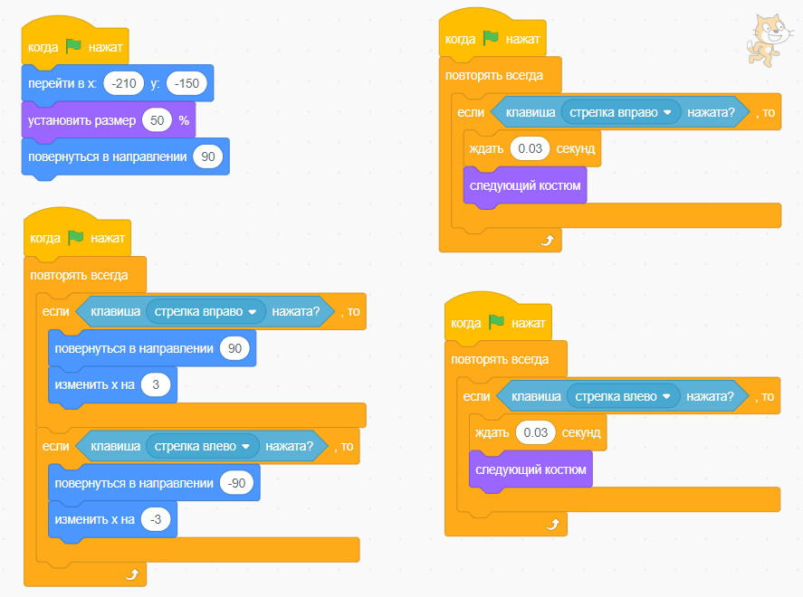

# Создание игр

- подбираем фон
- подбираем спрайты (даём им имена)

## Фишки
- Перед началом игры, нужно задать начальные значения всем спрайтам и фонам,
- Управление спрайтом вверх вниз влево вправо, лучше сделать церез цикл и условие.

## Движение спрайта с помощью клавиш

Чтобы двигать персонажем с помощью стрелок, можно воспользоваться одним из двух способов:
- событие "когда клавиша нажата",
- поместить в цикл условие + сенсор (более правильный способ),

Пример с событием "Когда клавиша 'Стрелка вправо' нажата":
- Когда клавиша 'Стрелка вправо' нажата
- Изменить x на 10
- Повернуться в направлении 90

Данным способом не получится зациклить смену костюмов при ходьбе. 

Пример с циклом, условием и сменой костюмов при ходьбе. Нужно создать два отдельных алгоритма первый для перемещения спрайта стрелками, второй для смены костюмов:

Перемещение спрайта стрелками (правильный подход):
- Когда флажок нажат
- Цикл повторять всегда (далее внутри цикла):
  - Если клавиша стрелка вправо нажата то (далее внутри условия):
    - Повернуться в направлении 90
    - Изменить х на 3
  - Если клавиша стрелка влево...

Смена костюмов, создаём отдельный алгоритм:
- Когда флажок нажат
- Цикл повторять всегда (далее внутри цикла):
  - Если клавиша стрелка вправо нажата то (далее внутри условия):
    - Ждать 0.03 сек
    - Следующий костюм
  - Если клавиша стрелка влево...

## Движение спрайта постоянное зацикленное
Например с верху падает яблоко и исчезает на земле и так бесконечно.

- Когда флажок нажат
- Цикл повторять всегда (далее внутри цикла):
  - Показаться
  - Перейти в x y
  - Плыть секунд в точку x y
  - Спрятаться

## Столкновение спрайтов
Столкновение можно вычислять по имени спрайтов (алгоритм пишется для каждого спрайта) или по цвету (алгоритм пишется для одного спрайта). В условие добавляем команды из `Сенсоры`.

- Когда флажок нажат
- Цикл повторять всегда (далее внутри цикла):
  - Если касается `имя спрайта` то (далее внутри условия):
    - Перейти в x y
    - Повернуться в направлении
  - Если касается `имя спрайта` то...

## Стоп игра
Когда игра завершена.

- Создаём событие "Победа"
- Для каждого спрайта создаём алгоритм срабатывающий при данном событии
- В этом алгоритме в основном скрываем не нужные элементы игры
- И перемещаем в центр основного персонажа рудующемуся победы

Пример:

- Когда я получу `Победа`
- Включить звук `Cheer`
- Перейти в x `0` y `0`
- Установить размер `100%`
- Изменить костюм на `костюм 1`
- Переключить фон на `Light`
